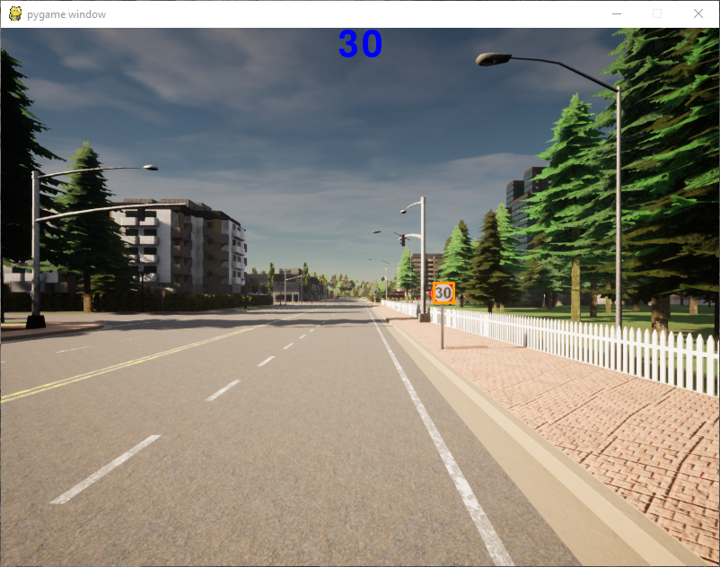
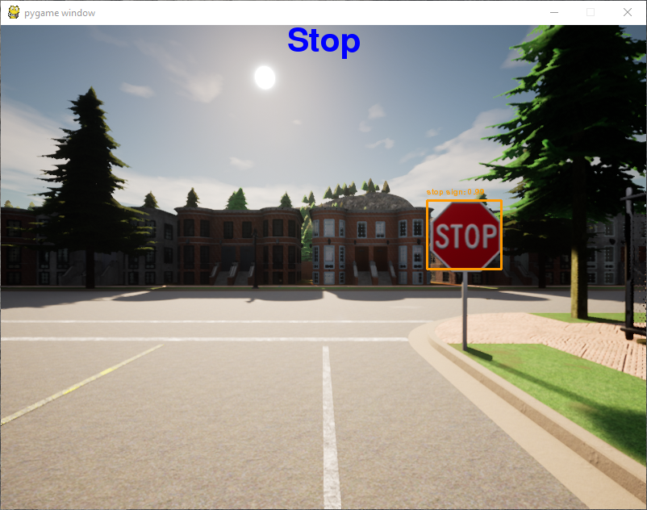
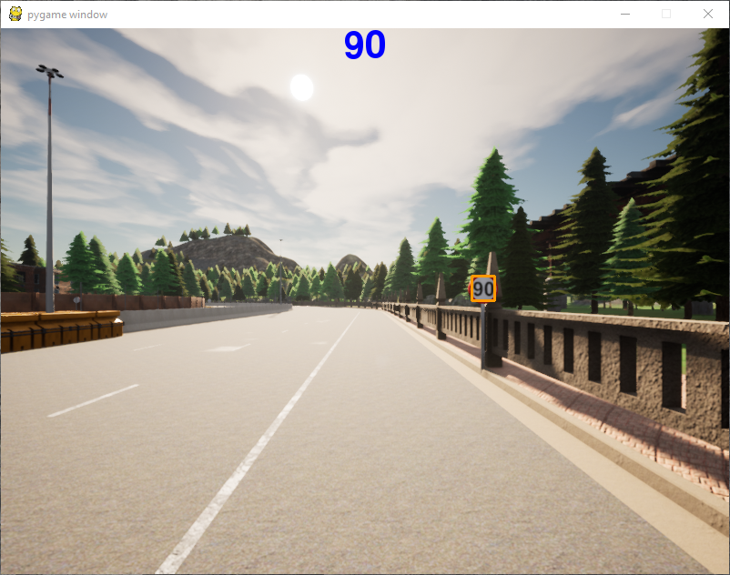

# TEES-Autonomous-vehicles

To run our model you need:

1 - do the tasks in this repo https://github.com/martisaju/CARLA-Speed-Traffic-Sign-Detection-Using-Yolo

2 - You need to install Tesseract 4

We recomend that you use a virtual enviroment to install our requirements file and to use Python in 3.7 version, after that you can run our model

3 - Install the requirements file and Python 3.7 

### Article

You can acces the article of this project in this [link](https://www.overleaf.com/read/ygwyqtwchpxs)

### Video presentation

You can acces our presentation of this project in this [link](https://youtu.be/VsVs8WCsez0)

### Screenshots 

* #### 30km/h Speed Traffic Sign detection

* #### Stop Traffic Sign detection

* #### 90km/h Speed Traffic Sign detection

